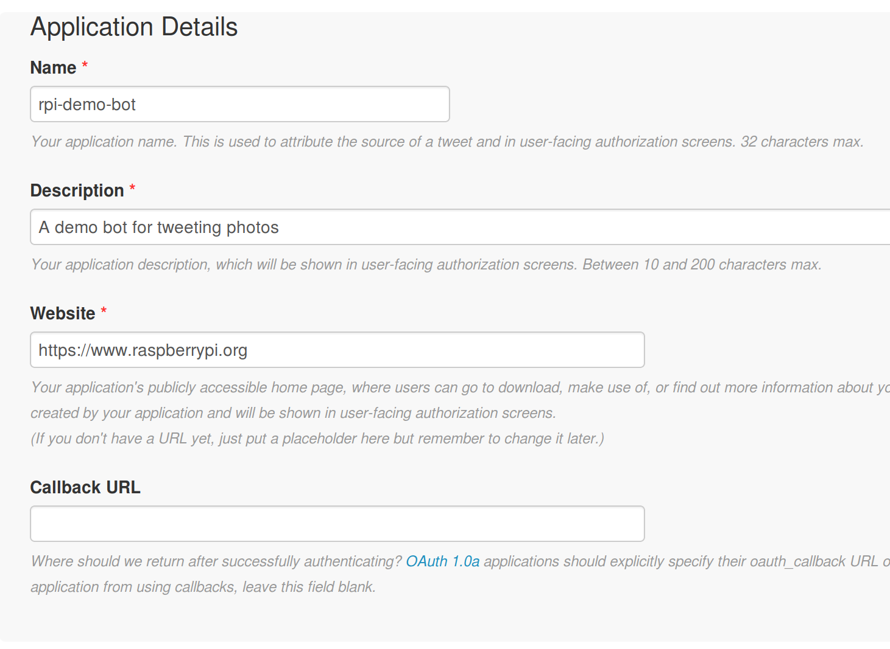
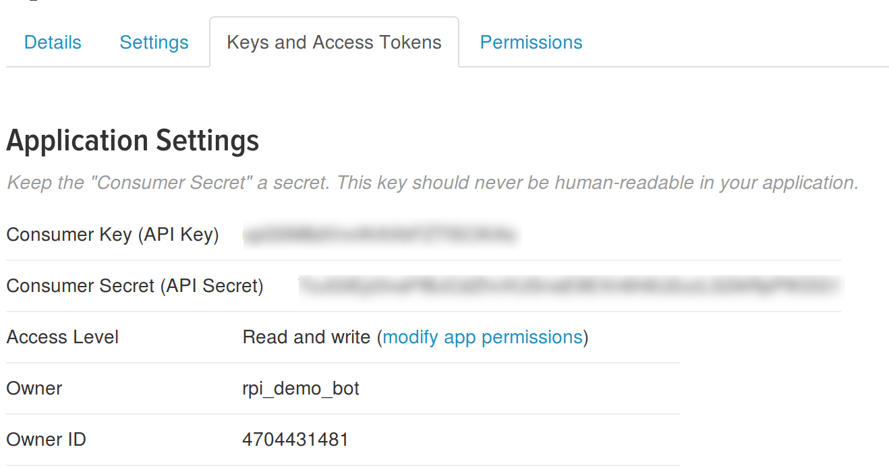
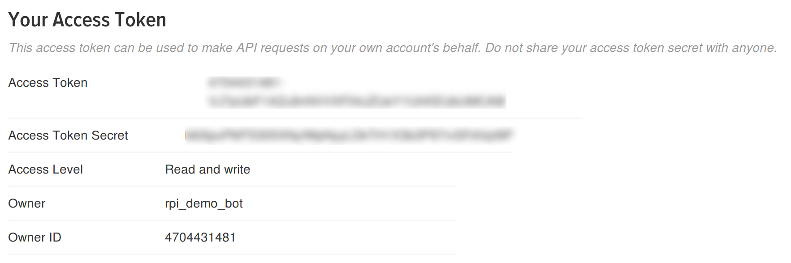

To use the Twitter API with any programming language, you'll need to complete a few simple steps:

*[API]: Application Programming Interface

  - Register a Twitter account (if you don't already have one to use)
  - Create a Twitter application
  - Copy your credentials
  
### Register for a Twitter account

- **Note:** If you are underage, check with your parents to be sure that they are okay with you having a Twitter account. If you are under 13, then you will have to ask a parent or guardian to set up an account for you using their name and information.

- Create a Twitter account at [twitter.com](https://twitter.com).

    

- You'll need to provide a phone number or email address to register an account, and only one account is allowed per email address.

- You might want to upload a photo and fill out the account's bio section, but make sure you are being safe and not uploading personally identifiable information.

### Create a Twitter application

Next you need to create a new Twitter application. This will allow you to authenticate the program you are about to write.

- Go to [apps.twitter.com](https://apps.twitter.com) and then click the **Create New App** button.

	
	
- You'll need to fill in a few details about your app. Don't worry about the 'Website' field, you can place any URL here for now if you don't own your own domain. The 'Callback URL' can be left blank. Click on the **Create Application** button when you are done.

	
	
- You'll now have an app that you can use to access the API. Clicking on the **Keys and Access Tokens** tab will reveal your authentication details for Twitter.

	
	
- Next you'll need to generate your **access tokens** by clicking on the **Create my access token** button at the bottom of the screen.

	
	
- All these keys, tokens, and secrets need to be kept secure. If you accidentally share them with someone, then you can regenerate them to get new random strings of characters.

### Copy your credentials

- The best way to store your credentials is to keep them on your computer in **JSON** format.

*[JSON]: A lightweight format to exchange data between computers.

- Open a text editor such as LeafPad, TextEdit, or Notepad. Create a new file and then add in your credentials in the following format.

```json
{
    "consumer_key": "I40wL40inrt43Z71eeoir1662",
    "consumer_secret": "ZwLwMeTuWIjA9v1aRJeJUxrSoBYbNxzrteSxiPl59mdbU7mS0b",
    "access_token": "1841344074-R5b20nSAYEwYUxyfw87MWCGeHPwe5WREbPIyDjg"
    "access_token_secret": "p4lRvFlaI5vGCjSCqvF1jCeTwx3BAAScJWutsQy8a2ZOFP"
}
```
- Save the file as `twitter_auth.json`.
