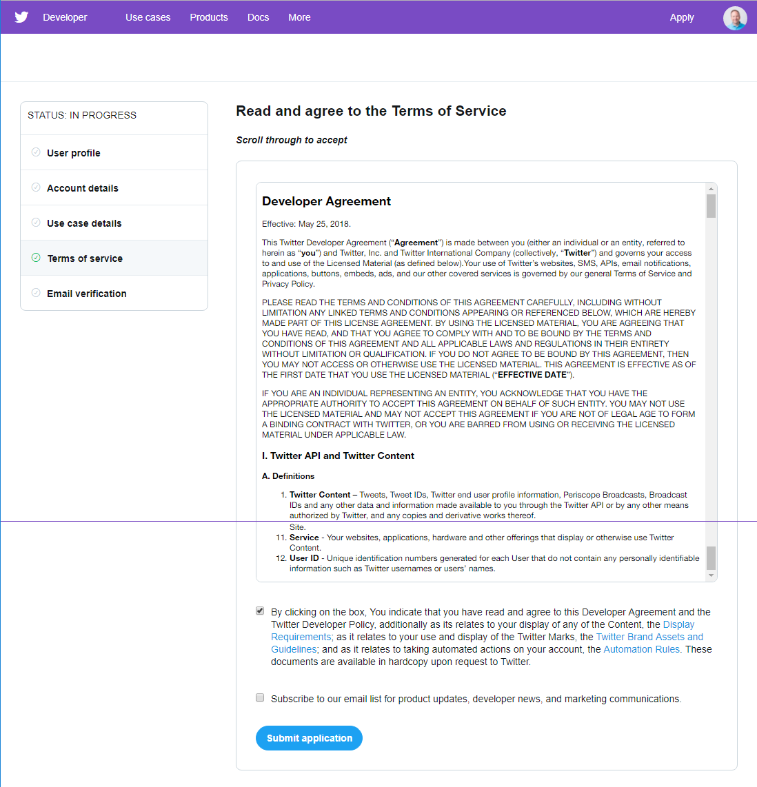

To use the Twitter API with any programming language, you'll need to complete a few simple steps:

*[API]: Application Programming Interface

  - Apply for a Twitter developer account (if you don't already have one to use)
  - Create a Twitter application
  - Copy your credentials

## Apply for a Twitter developer account

If you don't already have a Twitter account, you need to create one before you can apply for a developer account.

**Note:** If you are under 13, then you will have to ask a parent or guardian to set up an account for you using their name and information.

- Create a Twitter account at [twitter.com](https://twitter.com).

    

If you want to, you can upload a photo and fill out the bio.

- Apply for a developer account at [developer.twitter.com](https://developer.twitter.com).

    

- Complete the application process and submit your application.

--- collapse ---

---
title: How to complete the developer application
---

- Select the Twitter account you wish to apply with.

    

- Indicate whether you are requesting access for an organisation or for yourself, and confirm your primary country.

    

- Provide details about your project and describe what you will be doing.

    

- Read and agree to the **Terms of Service**.

    

--- /collapse ---

- You will receive an email from Twitter asking you to **confirm your email address**; follow the link in the email to confirm.

**Note**: once you confirm your email address, you need to wait for your application to be approved. This may take some time, and you can check the status of your application at [developer.twitter.com](https://developer.twitter.com).

### Create a Twitter application

After your developer account has been approved, you need to register your application with Twitter to get keys. These keys allow you to access your Twitter account from your Python program using the Twitter API (Application Programming Interface).

- Go to [developer.twitter.com](https://developer.twitter.com), select **Apps** from the menu, and click on the **Create an app** button.

    

- Complete the application details form. You must enter an app name, description, website (this can be *https://www.raspberrypi.org/* if you don't have one), and some information about how the app will be used. You can leave the other fields blank. Then click **Create**.

    

- Review the Developer Terms and click on **Create**.

    

- Click on the **Keys and tokens** tab to view your keys and access tokens.

- Click on the **Create** button under **Access token & access token secret**.

    

- You should now see your **Consumer API key**, **Consumer API secret key**, **Access token**, and **Access token secret**. You need these four keys to connect to your Twitter account from your Python program.

**Don't share these keys with anyone**, because they allow access to your Twitter account without your account password. If you share your code online, make sure not to include these keys. 

If you ever accidentally share or publish the keys, you should **regenerate** them at [developer.twitter.com](https://developer.twitter.com).


### Copy your credentials

- The best way to store your credentials is to keep them on your computer as a **JSON** file.

*[JSON]: A lightweight format to exchange data between computers.

- Open a text editor such as LeafPad, TextEdit, or Notepad. Create a new file and then add in your credentials in the following format.

```json
{
    "consumer_key": "I40wL40inrt43Z71eeoir1662",
    "consumer_secret": "ZwLwMeTuWIjA9v1aRJeJUxrSoBYbNxzrteSxiPl59mdbU7mS0b",
    "access_token": "1841344074-R5b20nSAYEwYUxyfw87MWCGeHPwe5WREbPIyDjg",
    "access_token_secret": "p4lRvFlaI5vGCjSCqvF1jCeTwx3BAAScJWutsQy8a2ZOFP"
}
```
- Save the file as `twitter_auth.json`.
