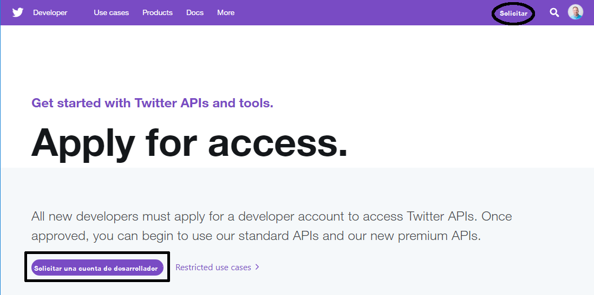
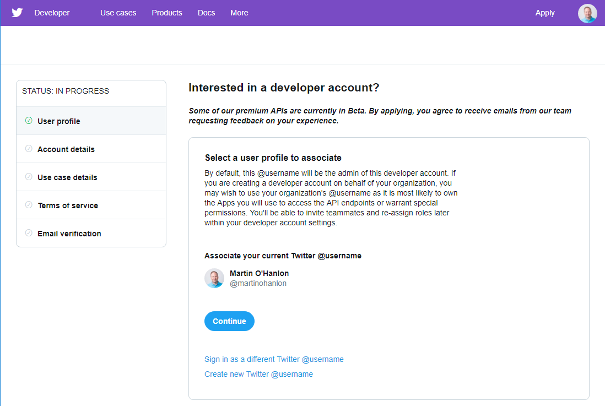
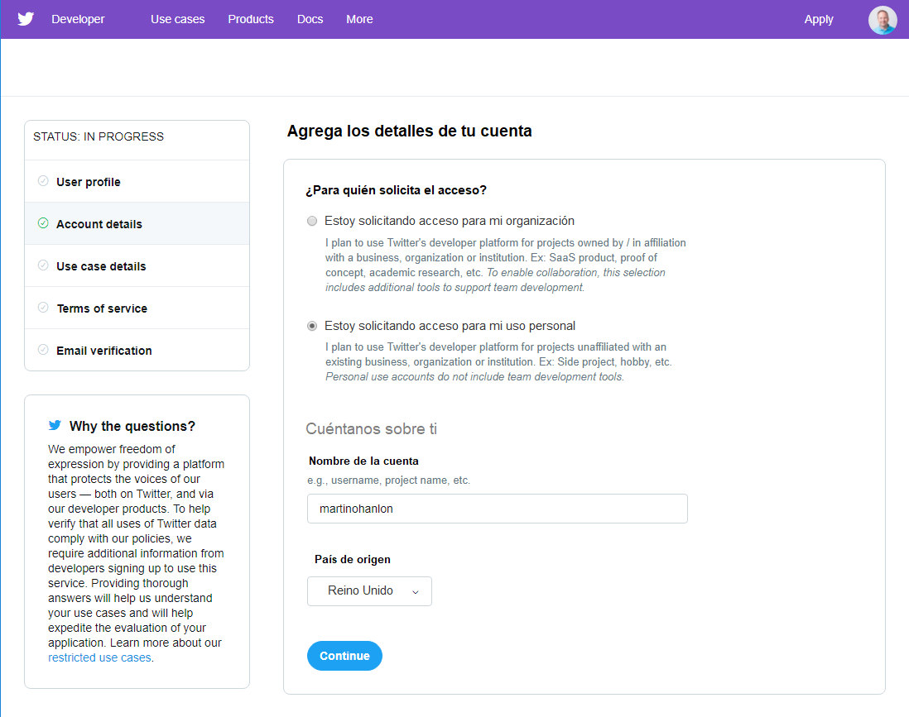

Para utilizar la API de Twitter con cualquier lenguaje de programación, necesitarás completar unos pocos pasos:

  - Solicita una cuenta de desarrollador de Twitter (si aún no tienes una para usar)
  - Crea una aplicación de Twitter
  - Copia tus credenciales

### Solicita una cuenta de desarrollador de Twitter

Si aún no tienes una cuenta de Twitter, necesitas crear una antes de poder solicitar una cuenta de desarrollador.

**Nota:** Si eres menor de 13 años, entonces tendrás que pedirle a un padre o tutor que configure una cuenta para ti usando su nombre e información.

- Crea una cuenta de Twitter en [twitter.com](https://twitter.com).

    

Si lo deseas, puedes subir una foto y completar la biografía.

- Solicita una cuenta de desarrollador en [developer.twitter.com](https://developer.twitter.com).

    

Completa el proceso de aplicación y envía tu solicitud.

- Selecciona la cuenta de Twitter con la que desees acceder.

    

- Indica si estás solicitando acceso para una organización o para ti mismo, y confirma tu país de origen.

    

- Proporciona detalles sobre tu proyecto y describe lo que estarás haciendo.

    

- Lee y acepta los **Términos de Servicio**.

    

- Recibirás un correo electrónico de Twitter pidiéndote **confirmar tu dirección de correo electrónico**; sigue el enlace en el correo electrónico para confirmarla.

**Nota**: una vez que confirmes tu dirección de correo electrónico, tienes que esperar a que se apruebe tu solicitud. Esto puede tomar algo de tiempo, y puedes comprobar el estado de tu aplicación en [developer.twitter.com](https://developer.twitter.com).

### Crea una aplicación de Twitter

Después de que tu cuenta de desarrollador haya sido aprobada, necesitas registrar tu aplicación con Twitter para obtener claves. Estas claves te permiten acceder a tu cuenta de Twitter desde tu programa Python usando la API (Aplicación de Interfaz de Programación) de Twitter.

- Ve a [developer.twitter.com](https://developer.twitter.com), selecciona **Apps** en el menú, y haz clic en el botón **Crear una aplicación**.

    

- Completa el formulario de información de la solicitud. Debes ingresar el nombre, la descripción y el sitio web de la aplicación (este puede ser *https://www.raspberrypi.org* si no tienes uno), y alguna información sobre cómo será utilizada la aplicación. Puedes dejar los otros campos en blanco. Luego haz clic en **Crear**.

    

- Revisa los Términos del Desarrollador y haz clic en **Crear**.

    

- Haz clic en la pestaña **Keys and tokens** para ver las claves y los identificadores de acceso.

- Haz clic en el botón **Crear** debajo de **Access token & access token secret**.

    

- Ahora deberías ver tu **Consumer API key (Clave de consumidor API)**, **Consumer API secret key (Secreto de consumidor API)**, **Access token (Token de acceso)**, y **Access token secret (Token de acceso secreto)**. Necesitas estas cuatro claves para conectarte a tu cuenta de Twitter desde tu programa Python.

**No compartas estas claves con nadie**, porque permiten el acceso a tu cuenta de Twitter sin la contraseña de tu cuenta. Si compartes tu código en línea, asegúrate de no incluir estas claves.

Si alguna vez compartes o publicas accidentalmente las claves, debes **regenerarlas** en [develop.twitter.com](https://developer.twitter.com).


### Copia tus credenciales

- La mejor manera de almacenar tus credenciales es mantenerlas en tu computadora como un archivo **JSON**.

- Abre un editor de texto como LeafPad, TextEdit, o Notepad. Cree un nuevo archivo y luego añade tus credenciales en el siguiente formato.

```json
{
    "consumer_key": "I40wL40inrt43Z71eeoir1662",
    "consumer_secret": "ZwLwMeTuWIjA9v1aRJeJUxrSoBYbNxzrteSxiPl59mdbU7mS0b",
    "access_token": "1841344074-R5b20nSAYEwYUxyfw87MWCGeHPwe5WREbPIyDjg",
    "access_token_secret": "p4lRvFlaI5vGCjSCqvF1jCeTwx3BAAScJWutsQy8a2ZOFP"
}
```
- Guardar el archivo como `twitter_auth.json`.
