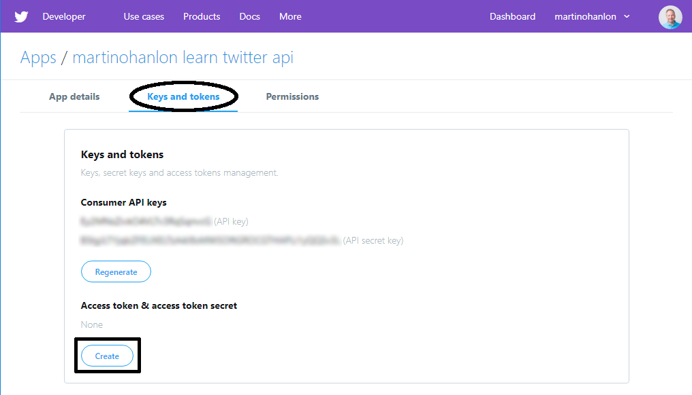

Om de Twitter API met elke programmeertaal te gebruiken, moet je een paar eenvoudige stappen uitvoeren:

  - Vraag een Twitter ontwikkelaarsaccount aan (als je er nog geen hebt om te gebruiken)
  - Maak een Twitter applicatie
  - Kopieer jouw inloggegevens

### Vraag een Twitter ontwikkelaarsaccount aan

Als je nog geen Twitter account hebt, moet je er een maken voordat je een ontwikkelaarsaccount kunt aanvragen.

**Opmerking:** Als je jonger bent dan 13, moet je een ouder of voogd vragen om een account voor je aan te maken met behulp van hun naam en informatie.

- Maak een Twitter account aan op [twitter.com](https://twitter.com).

    

Als je wilt, kun je een foto uploaden en de bio invullen.

- Vraag een ontwikkelaarsaccount aan op [developer.twitter.com](https://developer.twitter.com).

    

Voltooi het aanvraagproces en dien jouw aanvraag in.

- Selecteer het Twitter account waarmee je je wilt aanmelden.

    

- Geef aan of je toegang aanvraagt voor een organisatie of voor jezelf en bevestig jouw primaire land.

    

- Geef details over jouw project en beschrijf wat je gaat doen.

    

- Lees en ga akkoord met de **Terms of Service (Servicevoorwaarden)**.

    

- Je ontvangt een e-mail van Twitter waarin je wordt gevraagd om **je e-mailadres** te bevestigen; volg de link in de e-mail om te bevestigen.

**Opmerking**: zodra je je e-mailadres hebt bevestigd, moet je wachten tot jouw aanvraag is goedgekeurd. Dit kan enige tijd duren en je kunt de status van jouw toepassing controleren op [developer.twitter.com](https://developer.twitter.com).

### Maak een Twitter applicatie

Nadat jouw ontwikkelaarsaccount is goedgekeurd, moet je je toepassing registreren bij Twitter om sleutels te krijgen. Met deze sleutels heb je toegang tot jouw Twitter account vanuit jouw Python programma met behulp van de Twitter API (Application Programming Interface).

- Ga naar [developer.twitter.com](https://developer.twitter.com), selecteer **Apps** in het menu en klik op de knop **Create an App (Een app maken)**.

    

- Vul het aanvraagformulier in. You must enter an app name, description, website (this can be *https://www.raspberrypi.org* if you don't have one), and some information about how the app will be used. Je kunt de andere velden leeg laten. Klik vervolgens op **Create (Maken)**.

    

- Lees de ontwikkelaarsvoorwaarden en klik op **Create**.

    

- Klik op het tabblad **Keys and tokens (Sleutels en tokens)** om je sleutels en toegangstokens te bekijken.

- Klik op de knop **Create** onder **Access token & access token secret (Toegangstoken & toegangstoken-geheim)**.

    

- Je zou nu jouw **Consumer API sleutel**, **Consumer API geheime sleutel**, **Toegangstoken**, en **Toegangstoken-geheim** moeten zien. Je hebt deze vier sleutels nodig om vanuit jouw Python programma verbinding te maken met jouw Twitter account.

**Deel deze sleutels met niemand**, omdat deze toegang geven tot jouw Twitter account zonder jouw account wachtwoord. Als je jouw code online deelt, zorg er dan voor dat je deze sleutels niet opneemt.

Als je ooit per ongeluk de sleutels deelt of publiceert moet je ze **regenereren** op [developer.twitter.com](https://developer.twitter.com).


### Kopieer jouw inloggegevens

- De beste manier om jouw inloggegevens op te slaan, is deze op jouw computer te bewaren als een **JSON** bestand.

- Open een teksteditor zoals LeafPad, TextEdit of Kladblok. Maak een nieuw bestand en voeg vervolgens jouw gegevens toe met de volgende indeling.

```json
{
    "consumer_key": "I40wL40inrt43Z71eeoir1662",
    "consumer_secret": "ZwLwMeTuWIjA9v1aRJeJUxrSoBYbNxzrteSxiPl59mdbU7mS0b",
    "access_token": "1841344074-R5b20nSAYEwYUxyfw87MWCGeHPwe5WREbPIyDjg",
    "access_token_secret": "p4lRvFlaI5vGCjSCqvF1jCeTwx3BAAScJWutsQy8a2ZOFP"
}
```
- Sla het bestand op als `twitter_auth.json`.
